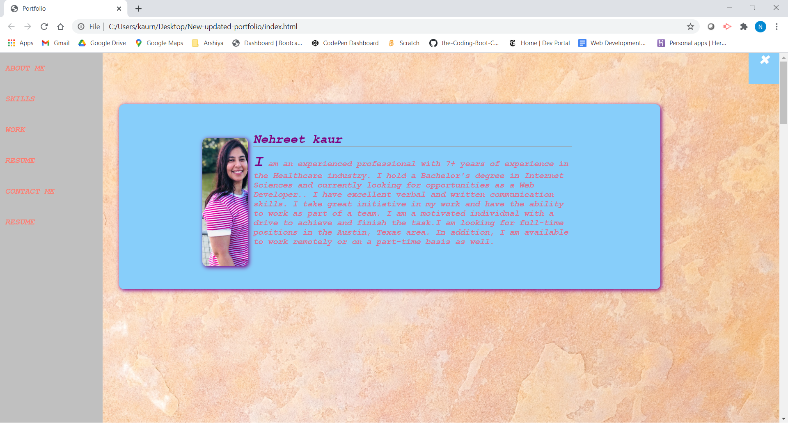

 # ABOUT 

**Portfolio** created and it's fully **Responsive**.I have **UPDATED** my 
**Portfolio**. Also, added **MY-RESUME** and  **SKILLS** SECTION.Also, new **SIDE MENU** and small **BUTTON** ON right side, when **clicked** can open and close the side menu.

 And I have used the **Flex-box** framework with fully ressponsiveness.

 # TABLE OF CONTENTS
 [OUTPUT](#Output)

 [WORK-AREA](#WORK-AREA)

 [RESOURCES-REFERRED](#RESOURCES-REFERRED)

 [TEXT-EDITOR](#TEXT-EDITOR)

 [PROGRAMMING-LANGUAGES](#PROGRMMING-LANGUAGE)

 [SCREEN-SHOTS](#SCREEN-SHOT)

 [GIT-HUB-REPOSITORY](#LINKS)
 
 [GIT-HUB-DEPLOYED](#LINKS)

 

 # Output
 This time I have Updated my **PORTFOLIO** and changed the color-scheme.

 I have given **Hover-effects** and added scroll side menu.

 Also,tried **Slanted/Skewed** Div for my footer section.
 **ADDEDD** **SKILLS**  section as well this time and **SIDE MENU**
 Can navigate within the page with the **LINKS** provided.

 # WORK-AREA

 Given breif **discription** about my **PROECT**
 and my ** Assignments** with the their **LINKS**
 to **GITHUB REPOITORY** and **GITHUB DEPLOYED Application**.
 Also, added my recent **PROJECT** and assignments.

 ## TEXT-EDITOR

 **VS-CODE**

 ## PROGRMMING-LANGUAGE 

   **HTML**

   **CSS**

   **JAVASCRIPT**

   ## FRAMEWORK USED
   
   **FLEX-BOX**

    
   
   ## **RESOURCES-REFERRED**

   [FONT-AWESOME](https://fontawesome.com/icons?d=gallery)

   [FOR SKEWED DIV STYLE](https://www.w3schools.com/css/tryit.asp?filename=trycss3_transform_skew)

   [SIDE-MENU](https://www.w3schools.com/howto/howto_js_sidenav.asp)

   ## SCREEN-SHOT
   
   
   

    
  ## LINKS
  [Git-hub Repository](https://github.com/nehreetkaur/updated-portfolio)

  [Git-hub DEPLOYED APPLICATION](https://nehreetkaur.github.io/updated-portfolio/)
   

